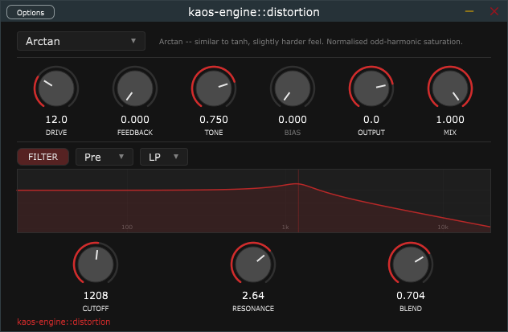
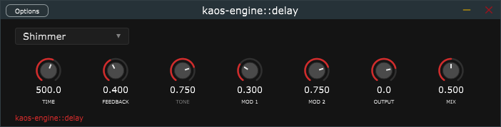
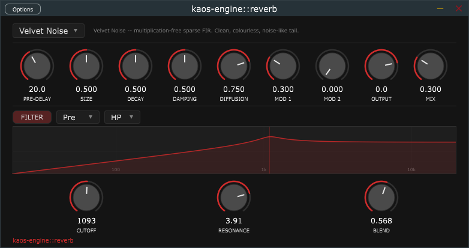
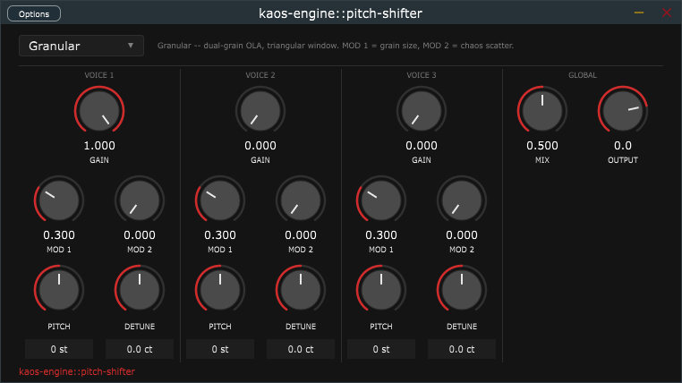
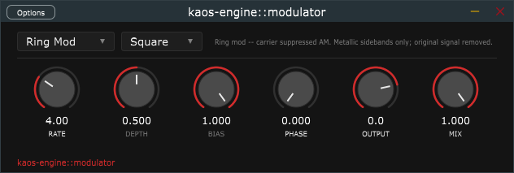

# kaos-engine

A collection of VST3 audio effects plugins for algorithmic sound design. Each plugin is
built around a focused set of controls, a minimal UI, and a selection of algorithms
covering a wide range of sonic character.

---

## Table of Contents

- [Plugins](#plugins)
  - [kaos-engine::distortion](#kaos-enginedistortion)
  - [kaos-engine::delay](#kaos-enginedelay)
  - [kaos-engine::reverb](#kaos-enginereverb)
  - [kaos-engine::pitch-shifter](#kaos-enginepitch-shifter)
  - [kaos-engine::modulator](#kaos-enginemodulator)
- [Building](#building)
- [Project layout](#project-layout)
- [License](#license)
- [Glossary](#glossary)

---

## Plugins

### kaos-engine::distortion

A waveshaper / distortion unit with 13 algorithms, a feedback path, and an optional
SVF that can be placed before or after the waveshaper.



**Algorithms**

| Mode | Character |
|---|---|
| **Soft** | tanh soft clip — warm, smooth, odd harmonics only |
| **Hard** | digital hard clip — aggressive, buzzy, square-wave character |
| **Foldback** | wavefolding — metallic, bell-like, FM-style inharmonics at high drive |
| **Tube** | asymmetric polynomial — even harmonics, warm tube emulation |
| **Arctan** | arctan soft clip — slightly harder feel than Soft; approaches hard clip at high drive |
| **Log** | logarithmic companding — Harmor Log-style, warm even harmonics when biased |
| **Sine Fold** | sin(g·x) — gentle saturation at low gain, complex FM-like content at high gain |
| **Diode** | exponential diode model — smooth saturation, Tube Screamer topology character |
| **Half-wave** | half-wave rectification — zeros one polarity, adds DC and even harmonics |
| **Full-wave** | full-wave rectification — flips negative cycles, octave-up character |
| **Chebyshev** | Chebyshev T₃ polynomial — precise odd harmonic generation |
| **Bitcrusher** | bit-depth reduction — quantization grit, coarse at low bit depths |
| **Sample Rate** | ZOH downsampling — intentional aliasing, metallic artifacts |

**Parameters**

| Knob | Symbol | Range | Description |
|---|---|---|---|
| Drive | g | 0–1 | Pre-gain into the waveshaper; higher = more harmonic content |
| Feedback | a | 0–1 | Feeds the distorted signal back into the input; adds resonance and sustain |
| Tone | t | 0–1 | One-pole LP filter on the output; rolls off high-frequency harshness |
| Bias | b | -1–+1 | DC offset before the waveshaper; introduces even harmonics (asymmetry) |
| Output | — | -20 to +6 dB | Post-processing output trim |
| Mix | w | 0–1 | Dry/wet blend: `out = dry + w*(wet - dry)` |

**Filter section** (independent SVF, optional)

| Control | Options | Description |
|---|---|---|
| Filter On | toggle | Enables the filter |
| Position | Pre / Post | Insert before or after the waveshaper |
| Type | LP / HP / BP | Simper SVF topology |
| Cutoff | 20 Hz – 20 kHz | Filter cutoff frequency |
| Resonance | 0.1 – 10 | Q factor |
| Blend | 0–1 | Mixes filtered and unfiltered signal |

---

### kaos-engine::delay

A stereo digital delay with 11 modes covering everything from clean utility echoes to
creative tape and granular effects. MOD 1 and MOD 2 control LFO rate and depth
respectively, with meaning specific to each mode.



**Modes**

| Mode | Character |
|---|---|
| **Standard** | Clean stereo delay — utility echo, faithful repeats |
| **Slapback** | Short single repeat (70–200 ms) — vintage rockabilly/drum room |
| **Ping-Pong** | Alternating L/R feedback — bouncing stereo spread |
| **Tape** | Multi-head with LFO pitch modulation — warm, degrading, wow/flutter |
| **Diffusion** | AP chain before delay — dense echo cloud, reverb-like onset |
| **Reverse** | Backward playback — ghostly rising swells |
| **Comb** | Short resonant delay (no LP) — pitched metallic drone, reverb building block |
| **Multi-Tap** | Multiple independent read heads — rhythmic BPM-synced patterns |
| **Shimmer** | AP diffusor + pitch-shifted (+1 octave) feedback — ethereal swell |
| **Haas** | Fixed L/R offset (<40 ms) — mono-safe stereo widening |
| **BBD** | Bucket-brigade emulation — warm analog chorus/delay with clock modulation |

**Parameters**

| Knob | Symbol | Range | Description |
|---|---|---|---|
| Time | d | 1–3000 ms | Delay time; meaning varies by mode |
| Feedback | g | 0–1 | Feedback gain; controls repeat count and tail length |
| Tone | t | 0–1 | LP filter in feedback path; 0 = dark, 1 = bright |
| Mod 1 | m1 | 0–1 | LFO rate (e.g. wow/flutter speed for Tape; clock rate for BBD) |
| Mod 2 | m2 | 0–1 | LFO depth (e.g. pitch deviation depth; detuning amount) |
| Output | — | -20 to +6 dB | Post-mix output trim |
| Mix | w | 0–1 | Dry/wet blend |

---

### kaos-engine::reverb

An algorithmic reverb with 7 fundamentally different reverb engines, pre/post filter,
and separate MOD 1 / MOD 2 controls for LFO rate and detuning depth. All algorithms
apply LFO modulation to break up standing-wave resonances.



**Algorithms**

| Algorithm | Character |
|---|---|
| **Dattorro** | Classic plate reverb (JAES 1997) — smooth, bright, dense. Cross-coupled modulated tank. Best for vocals, snare, melodic instruments |
| **Schroeder** | First digital reverb (1962) — parallel combs + series APs. Coloured, ringy; use high DIFFUSION to tame metallic resonance |
| **FDN** | FDN with 4 delay lines, Hadamard mixing. Clean, transparent, uniform. Closest to convolution quality |
| **Gardner** | Room reverb (1992) — nested AP feedback loop. Warm, intimate, distinct early reflections. Good for drums, acoustic instruments |
| **Moorer** | 8-tap early reflection tapped delay + Schroeder tail (1979). Most natural-sounding of the classic algorithms |
| **Velvet Noise** | Sparse FIR with ±1 pulses and exponential decay. No modal coloration, clean noise-like tail. SIZE controls tail/RT60, DIFFUSION controls pulse density |
| **Shimmer** | Dattorro plate with granular pitch shifter (+0 to +12 semitones) in the cross-feedback loop. MOD 1 = shimmer mix; MOD 2 = pitch interval |

**Parameters**

| Knob | Symbol | Range | Description |
|---|---|---|---|
| Pre-Delay | p | 0–200 ms | Time before reverb onset; conveys source distance |
| Size | s | 0–1 | Scales all internal delay lengths; affects room size and RT60 |
| Decay | g | 0–1 | Feedback gain; controls tail length (RT60) |
| Damping | D | 0–1 | LP cutoff in feedback path; 0 = dark (500 Hz), 1 = bright (20 kHz) |
| Diffusion | a | 0–1 | AP coefficient; 0 = sparse/echoy onset, 1 = dense/smooth onset |
| Mod 1 | m1 | 0–1 | LFO rate (0.05–2 Hz); detuning modulation speed. Active for all algorithms |
| Mod 2 | m2 | 0–1 | LFO depth (0–16 samples); detuning amount. 0 = no pitch variation |
| Output | — | -20 to +6 dB | Post-mix output trim |
| Mix | w | 0–1 | Dry/wet blend |

For **Shimmer** only: MOD 1 = shimmer mix (0 = pure plate, 1 = full pitch-shifted feedback); MOD 2 = pitch interval (0 = unison, 1 = +12 semitones / +1 octave).

For **Velvet Noise**: DECAY and MOD are unused; SIZE controls both room size and RT60.

**Filter section** (same SVF as distortion, optional)

| Control | Options | Description |
|---|---|---|
| Filter On | toggle | Enables the filter |
| Position | Pre / Post | Insert before or after the reverb |
| Type | LP / HP / BP | Simper SVF |
| Cutoff | 20 Hz – 20 kHz | Filter cutoff |
| Resonance | 0.1 – 10 | Q factor |
| Blend | 0–1 | Parallel blend between filtered and direct signal |

---

### kaos-engine::pitch-shifter

A granular pitch shifter with 3 independent voices. Each voice has its own pitch, fine
detune, gain, and per-algorithm modulation controls. Voices with GAIN set to zero are
skipped entirely with no CPU cost. PITCH and DETUNE can be entered numerically via
editable text boxes at the bottom of the UI.



**Algorithms**

| Algorithm | Character | MOD 1 | MOD 2 |
|---|---|---|---|
| **Granular** | Dual-grain OLA with triangular crossfade windows. Slight constant graininess, works on any material | Grain size (20–200 ms) — smaller = more percussive; larger = more smeared | Chaos — random grain read-position scatter (0 = deterministic, 1 = ±30% of grain) |
| **Smooth** | Dual-grain OLA with Hann windows (ea + eb = 1, no amplitude ripple). Less grainy, better for sustained notes and pads | Grain size (80–300 ms) | Chaos — same as Granular |
| **Tape** | Single moving read pointer with smooth crossfade on wrap. Transparent between crossfades; periodic stutter at crossfade points (~every 400 ms at +12 st) | Flutter rate (0–8 Hz) — sinusoidal tape wow/flutter | Flutter depth (0–±16 samples ≈ ±4 cents at 1 kHz); has no effect if MOD 1 = 0 |

**Per-voice parameters** (×3 voices)

| Knob | Symbol | Range | Description |
|---|---|---|---|
| Gain | g | 0–1 | Voice output level. Set to 0 to silence and skip the voice entirely |
| Mod 1 | m1 | 0–1 | Grain size (Granular/Smooth) or flutter rate (Tape); see table above |
| Mod 2 | m2 | 0–1 | Chaos scatter (Granular/Smooth) or flutter depth (Tape) |
| Pitch | p | -24 to +24 st | Pitch shift in semitones (integer steps). Also editable via text box |
| Detune | d | -50 to +50 ct | Fine pitch offset in cents. `pitch_factor = 2^((p + d/100) / 12)` |

**Global parameters**

| Knob | Range | Description |
|---|---|---|
| Mix | 0–1 | Dry/wet blend. Wet signal is the gain-weighted sum of active voices |
| Output | -20 to +6 dB | Post-mix output trim |

**Default voice configuration:** Voice 1 is active at unity gain (GAIN = 1.0), Voices 2
and 3 are silent (GAIN = 0.0). Raise their GAIN to add additional harmony or detuning
layers. The three voices accumulate additively — use the Output knob to compensate if
level increases when enabling more voices.

---

### kaos-engine::modulator



An AM / tremolo / ring modulator with a shared carrier oscillator. All three modes use
the same underlying multiply `y[n] = x[n] · m[n]`; the mode selector determines the
form of the modulator signal. PHASE offsets the right-channel oscillator for stereo effects.

**Modes**

| Mode | Modulator m[n] | Character |
|---|---|---|
| **Tremolo** | `(1 − d) + d · pos_osc` where pos_osc ∈ [0, 1] | Sub-audio amplitude flutter. DEPTH controls how deep the trough cuts (0 = no flutter, 1 = full silence at trough) |
| **AM** | `b + d · osc` | Audio-rate AM: original signal preserved (BIAS = 1) or suppressed (BIAS = 0), with sidebands at f_in ± RATE |
| **Ring Mod** | `osc` | Carrier-suppressed AM: only sidebands remain at MIX = 1. Harmonic when RATE is a multiple of the input fundamental; metallic and bell-like otherwise |

**Parameters**

| Knob | Symbol | Range | Description |
|---|---|---|---|
| Rate | f | 0.05–10 000 Hz | Oscillator frequency. Use sub-20 Hz for tremolo; audio rate for AM / ring mod |
| Depth | d | 0–1 | Modulation amount. Inactive for Ring Mod (use MIX instead) |
| Bias | b | 0–1 | DC offset on the carrier. 1 = original preserved (AM); 0 = carrier suppressed (ring mod). Active in AM mode only |
| Phase | p | 0–1 (= 0–180°) | Right-channel oscillator phase offset. 0 = mono, 0.5 = 90° quadrature stereo tremolo, 1 = 180° anti-phase |
| Output | — | -20 to +6 dB | Post-processing output trim |
| Mix | w | 0–1 | Dry/wet blend |

**Waveforms** (combo box, all modes): Sine · Triangle · Square · Saw

---

## Building

Requires [Meson](https://mesonbuild.com/) >= 1.1 and a C++17 compiler.

```sh
meson setup build --buildtype=release
meson compile -C build
```

Targets: **Windows** (x86_64, MinGW-w64) and **Linux** (x86_64).
Output format: **VST3** (plus standalone executables for testing).

---

## Project layout

```
kaos-engine/
├── meson.build              # top-level build definition
├── src/
│   ├── effects/
│   │   ├── distortion/      # waveshaper DSP
│   │   ├── delay/           # delay line DSP
│   │   ├── reverb/          # reverb algorithms
│   │   ├── pitch_shifter/   # granular pitch shifting DSP (3 voices, 3 algorithms)
│   │   └── modulator/       # AM / tremolo / ring mod DSP
│   ├── plugin/              # JUCE AudioProcessor wrappers + editors + shared LookAndFeel
│   └── standalone/          # standalone app build targets
├── third_party/             # JUCE 7 (git submodule)
└── build/                   # generated by meson (not committed)
```

All C++ symbols live in the `kaos_engine` namespace.

---

## License

[GNU Affero General Public License v3.0](https://www.gnu.org/licenses/agpl-3.0.html) (AGPL-3.0)

---

## Glossary

Acronyms and abbreviations used across the plugins, UI labels, and documentation.

| Acronym | Full name | Description |
|---|---|---|
| **AM** | Amplitude Modulation | Multiplying a signal by a carrier to produce sidebands at f_in ± f_carrier. When the carrier includes a DC bias the original signal is preserved alongside the sidebands. |
| **AP** | Allpass (filter) | A filter with a flat magnitude response that shifts phase. Used for diffusion in reverbs and as a fractional-delay interpolator. An AP section: `y[n] = −a·x[n] + x[n−1] + a·y[n−1]`. |
| **BBD** | Bucket-Brigade Device | An analog delay line built from a chain of capacitors that pass charge from stage to stage at a clock rate. Emulated here via a shift-register buffer with a low-pass output filter. |
| **BP** | Band-Pass (filter) | A filter that passes a band of frequencies centred on the cutoff and attenuates both below and above it. |
| **BPM** | Beats Per Minute | Tempo unit. Used to sync delay times to a musical grid: `quarter_note_ms = 60 000 / BPM`. |
| **CPU** | Central Processing Unit | General compute load. Used informally to mean DSP processing cost per sample block. |
| **ct** | Cent | One hundredth of a semitone. Used for fine pitch offsets: 100 ct = 1 st. |
| **dB** | Decibel | Logarithmic unit of level. +6 dB ≈ double amplitude; −6 dB ≈ half amplitude. |
| **DC** | Direct Current (offset) | A non-zero mean value in an audio signal. Asymmetric waveshapers and rectifiers introduce DC; removed with a DC-blocking IIR filter: `y[n] = x[n] − x[n−1] + R·y[n−1]`, R ≈ 0.995. |
| **DSP** | Digital Signal Processing | The mathematics of manipulating audio (or other signals) in the discrete-time domain. |
| **FDN** | Feedback Delay Network | A reverb architecture of N delay lines cross-coupled through a unitary mixing matrix (typically Hadamard). Energy-preserving; produces smooth, dense tails. |
| **FIR** | Finite Impulse Response | A filter whose output depends only on a finite window of past inputs; always stable. Used in windowed-sinc interpolation and velvet-noise reverb. |
| **FM** | Frequency Modulation | Varying the instantaneous frequency (or phase) of a carrier by a modulator signal. At audio rates this generates sidebands described by Bessel functions. |
| **Hz / kHz** | Hertz / Kilohertz | Cycles per second / thousands of cycles per second. Used for frequencies and sample rates. |
| **HP** | High-Pass (filter) | A filter that passes frequencies above the cutoff and attenuates those below it. |
| **IIR** | Infinite Impulse Response | A filter with feedback; its output depends on past outputs as well as past inputs. Can be unstable if poles are outside the unit circle. Used for AP sections, tone filters, and DC blockers. |
| **IR** | Impulse Response | The output of a system when fed a single unit impulse. Fully characterises a linear time-invariant system; used in convolution reverb. |
| **JAES** | Journal of the Audio Engineering Society | Peer-reviewed publication. The Dattorro plate reverb algorithm originates from a 1997 JAES paper. |
| **JUCE** | Jules' Utility Class Extensions | Open-source C++ framework for building audio plugins and applications. Provides the VST3 wrapper, GUI components, and audio I/O used by kaos-engine. |
| **LFO** | Low-Frequency Oscillator | An oscillator running at sub-audio rates (typically 0.05–20 Hz) used to modulate parameters over time (tremolo, vibrato, wow/flutter). |
| **LP** | Low-Pass (filter) | A filter that passes frequencies below the cutoff and attenuates those above it. Used for tone shaping and as a damping filter in delay/reverb feedback paths. |
| **ms** | Milliseconds | One thousandth of a second. Standard unit for delay times and reverb pre-delay. |
| **OLA** | Overlap-Add | A time-domain technique for time-stretching and pitch-shifting. Successive windowed frames of the input are written at a different hop size to stretch or compress time; resampling then corrects pitch. |
| **Q** | Quality factor | Dimensionless measure of filter resonance. Q = f_centre / bandwidth. Q = 0.707 gives a maximally flat (Butterworth) response; higher Q produces a sharper resonant peak. |
| **RT60** | Reverberation Time (60 dB) | The time for a room's sound energy to decay by 60 dB after a source stops. A standard measure of perceived reverb length. |
| **st** | Semitone | One twelfth of an octave. A frequency ratio of 2^(1/12) ≈ 1.0595. |
| **SVF** | State Variable Filter | A two-integrator-loop filter topology (Simper variant used here) that simultaneously outputs LP, HP, and BP responses from the same state, making it easy to switch type without discontinuity. |
| **VST3** | Virtual Studio Technology 3 | Plugin format developed by Steinberg. The standard format for audio effects and instruments on Windows and Linux. kaos-engine builds each effect as a `.vst3` bundle. |
| **ZOH** | Zero-Order Hold | A sample-and-hold operation that holds the last sampled value for N samples before updating. Used in sample-rate reduction to produce intentional aliasing artifacts. |
