# kaos-engine

A collection of VST3 audio effects plugins and modulation controllers for algorithmic sound design.
Each plugin is built around a focused set of controls, a minimal UI, and a selection of algorithms
covering a wide range of sonic character.

---

## Installation

Download the latest release for your platform from the
[Releases page](../../releases/latest), then copy the plugin bundles to your
VST3 folder.

**Windows**

Copy the `.vst3` folders into one of:
- `C:\Program Files\Common Files\VST3` (system-wide, requires Administrator)
- `%APPDATA%\Common Files\VST3` (current user only, no elevation needed)

```
kaos-engine-distortion.vst3  ->  C:\Program Files\Common Files\VST3\
kaos-engine-delay.vst3       ->  C:\Program Files\Common Files\VST3\
...
```

**macOS**

Copy the `.vst3` folders into one of:
- `/Library/Audio/Plug-Ins/VST3` (system-wide)
- `~/Library/Audio/Plug-Ins/VST3` (current user only)

**Linux**

Copy the `.vst3` folders into one of:
- `/usr/lib/vst3` (system-wide)
- `~/.vst3` (current user only)

After copying, rescan plugins in your DAW. The plugins will appear under the
manufacturer name **kaos-engine**.

**CLAP (kaos-engine::lfo only)**

The release also includes `kaos-engine-lfo.clap`. Copy it to your CLAP folder:
- Windows: `%APPDATA%\CLAP` or `C:\Program Files\Common Files\CLAP`
- macOS: `~/Library/Audio/Plug-Ins/CLAP`
- Linux: `~/.clap`

---

## Table of Contents

- [Effects](#effects)
  - [kaos-engine::distortion](#kaos-enginedistortion)
  - [kaos-engine::delay](#kaos-enginedelay)
  - [kaos-engine::reverb](#kaos-enginereverb)
  - [kaos-engine::pitch-shifter](#kaos-enginepitch-shifter)
  - [kaos-engine::modulator](#kaos-enginemodulator)
  - [kaos-engine::frequency-shifter](#kaos-enginefrequency-shifter)
  - [kaos-engine::filter](#kaos-enginefilter)
  - [kaos-engine::eq](#kaos-engineeq)
  - [kaos-engine::compressor](#kaos-enginecompressor)
  - [kaos-engine::gate](#kaos-enginegate)
  - [kaos-engine::noise](#kaos-enginenoise)
  - [kaos-engine::looper](#kaos-enginelooper)
- [Analyzers](#analyzers)
  - [kaos-engine::spectrogram](#kaos-enginespectrogram)
- [Controllers](#controllers)
  - [kaos-engine::lfo](#kaos-enginelfo)
  - [kaos-engine::stochastic](#kaos-enginestochastic)
  - [kaos-engine::envelope-follower](#kaos-engineenvelope-follower)
- [Building](#building)
- [Project layout](#project-layout)
- [License](#license)
- [Glossary](#glossary)

---

## Effects

Effects process audio — they modify, shape, or transform the sound passing through them.

---

### kaos-engine::distortion

A waveshaper / distortion unit with 13 algorithms, a feedback path, and an optional
SVF that can be placed before or after the waveshaper.


**Algorithms**

| Mode | Character |
|---|---|
| **Soft** | tanh soft clip — warm, smooth, odd harmonics only |
| **Hard** | digital hard clip — aggressive, buzzy, square-wave character |
| **Foldback** | wavefolding — metallic, bell-like, FM-style inharmonics at high drive |
| **Tube** | asymmetric polynomial — even harmonics, warm tube emulation |
| **Arctan** | arctan soft clip — slightly harder feel than Soft; approaches hard clip at high drive |
| **Log** | logarithmic companding — Harmor Log-style, warm even harmonics when biased |
| **Sine Fold** | sin(g·x) — gentle saturation at low gain, complex FM-like content at high gain |
| **Diode** | exponential diode model — smooth saturation, Tube Screamer topology character |
| **Half-wave** | half-wave rectification — zeros one polarity, adds DC and even harmonics |
| **Full-wave** | full-wave rectification — flips negative cycles, octave-up character |
| **Chebyshev** | Chebyshev T₃ polynomial — precise odd harmonic generation |
| **Bitcrusher** | bit-depth reduction — quantization grit, coarse at low bit depths |
| **Sample Rate** | ZOH downsampling — intentional aliasing, metallic artifacts |

**Parameters**

| Knob | Symbol | Range | Description |
|---|---|---|---|
| Drive | g | 0–1 | Pre-gain into the waveshaper; higher = more harmonic content |
| Feedback | a | 0–1 | Feeds the distorted signal back into the input; adds resonance and sustain |
| Tone | t | 0–1 | One-pole LP filter on the output; rolls off high-frequency harshness |
| Bias | b | -1–+1 | DC offset before the waveshaper; introduces even harmonics (asymmetry) |
| Output | — | -20 to +6 dB | Post-processing output trim |
| Mix | w | 0–1 | Dry/wet blend: `out = dry + w*(wet - dry)` |

**Filter section** (independent SVF, optional)

| Control | Options | Description |
|---|---|---|
| Filter On | toggle | Enables the filter |
| Position | Pre / Post | Insert before or after the waveshaper |
| Type | LP / HP / BP | Simper SVF topology |
| Cutoff | 20 Hz – 20 kHz | Filter cutoff frequency |
| Resonance | 0.1 – 10 | Q factor |
| Blend | 0–1 | Mixes filtered and unfiltered signal |

---

### kaos-engine::delay

A stereo digital delay with 11 modes covering everything from clean utility echoes to
creative tape and granular effects. MOD 1 and MOD 2 control LFO rate and depth
respectively, with meaning specific to each mode.


**Modes**

| Mode | Character |
|---|---|
| **Standard** | Clean stereo delay — utility echo, faithful repeats |
| **Slapback** | Short single repeat (70–200 ms) — vintage rockabilly/drum room |
| **Ping-Pong** | Alternating L/R feedback — bouncing stereo spread |
| **Tape** | Multi-head with LFO pitch modulation — warm, degrading, wow/flutter |
| **Diffusion** | AP chain before delay — dense echo cloud, reverb-like onset |
| **Reverse** | Backward playback — ghostly rising swells |
| **Comb** | Short resonant delay (no LP) — pitched metallic drone, reverb building block |
| **Multi-Tap** | Multiple independent read heads — rhythmic BPM-synced patterns |
| **Shimmer** | AP diffusor + pitch-shifted (+1 octave) feedback — ethereal swell |
| **Haas** | Fixed L/R offset (<40 ms) — mono-safe stereo widening |
| **BBD** | Bucket-brigade emulation — warm analog chorus/delay with clock modulation |

**Parameters**

| Knob | Symbol | Range | Description |
|---|---|---|---|
| Time | d | 1–3000 ms | Delay time; meaning varies by mode |
| Feedback | g | 0–1 | Feedback gain; controls repeat count and tail length |
| Tone | t | 0–1 | LP filter in feedback path; 0 = dark, 1 = bright |
| Mod 1 | m1 | 0–1 | LFO rate (e.g. wow/flutter speed for Tape; clock rate for BBD) |
| Mod 2 | m2 | 0–1 | LFO depth (e.g. pitch deviation depth; detuning amount) |
| Output | — | -20 to +6 dB | Post-mix output trim |
| Mix | w | 0–1 | Dry/wet blend |

---

### kaos-engine::reverb

An algorithmic reverb with 7 fundamentally different reverb engines, pre/post filter,
and separate MOD 1 / MOD 2 controls for LFO rate and detuning depth. All algorithms
apply LFO modulation to break up standing-wave resonances.


**Algorithms**

| Algorithm | Character |
|---|---|
| **Dattorro** | Classic plate reverb (JAES 1997) — smooth, bright, dense. Cross-coupled modulated tank. Best for vocals, snare, melodic instruments |
| **Schroeder** | First digital reverb (1962) — parallel combs + series APs. Coloured, ringy; use high DIFFUSION to tame metallic resonance |
| **FDN** | FDN with 4 delay lines, Hadamard mixing. Clean, transparent, uniform. Closest to convolution quality |
| **Gardner** | Room reverb (1992) — nested AP feedback loop. Warm, intimate, distinct early reflections. Good for drums, acoustic instruments |
| **Moorer** | 8-tap early reflection tapped delay + Schroeder tail (1979). Most natural-sounding of the classic algorithms |
| **Velvet Noise** | Sparse FIR with ±1 pulses and exponential decay. No modal coloration, clean noise-like tail. SIZE controls tail/RT60, DIFFUSION controls pulse density |
| **Shimmer** | Dattorro plate with granular pitch shifter (+0 to +12 semitones) in the cross-feedback loop. MOD 1 = shimmer mix; MOD 2 = pitch interval |

**Parameters**

| Knob | Symbol | Range | Description |
|---|---|---|---|
| Pre-Delay | p | 0–200 ms | Time before reverb onset; conveys source distance |
| Size | s | 0–1 | Scales all internal delay lengths; affects room size and RT60 |
| Decay | g | 0–1 | Feedback gain; controls tail length (RT60) |
| Damping | D | 0–1 | LP cutoff in feedback path; 0 = dark (500 Hz), 1 = bright (20 kHz) |
| Diffusion | a | 0–1 | AP coefficient; 0 = sparse/echoy onset, 1 = dense/smooth onset |
| Mod 1 | m1 | 0–1 | LFO rate (0.05–2 Hz); detuning modulation speed. Active for all algorithms |
| Mod 2 | m2 | 0–1 | LFO depth (0–16 samples); detuning amount. 0 = no pitch variation |
| Output | — | -20 to +6 dB | Post-mix output trim |
| Mix | w | 0–1 | Dry/wet blend |

For **Shimmer** only: MOD 1 = shimmer mix (0 = pure plate, 1 = full pitch-shifted feedback); MOD 2 = pitch interval (0 = unison, 1 = +12 semitones / +1 octave).

For **Velvet Noise**: DECAY and MOD are unused; SIZE controls both room size and RT60.

**Filter section** (same SVF as distortion, optional)

| Control | Options | Description |
|---|---|---|
| Filter On | toggle | Enables the filter |
| Position | Pre / Post | Insert before or after the reverb |
| Type | LP / HP / BP | Simper SVF |
| Cutoff | 20 Hz – 20 kHz | Filter cutoff |
| Resonance | 0.1 – 10 | Q factor |
| Blend | 0–1 | Parallel blend between filtered and direct signal |

---

### kaos-engine::pitch-shifter

A granular pitch shifter with 3 independent voices. Each voice has its own pitch, fine
detune, gain, and per-algorithm modulation controls. Voices with GAIN set to zero are
skipped entirely with no CPU cost. PITCH and DETUNE can be entered numerically via
editable text boxes at the bottom of the UI.


**Algorithms**

| Algorithm | Character | MOD 1 | MOD 2 |
|---|---|---|---|
| **Granular** | Dual-grain OLA with triangular crossfade windows. Slight constant graininess, works on any material | Grain size (20–200 ms) — smaller = more percussive; larger = more smeared | Chaos — random grain read-position scatter (0 = deterministic, 1 = ±30% of grain) |
| **Smooth** | Dual-grain OLA with Hann windows (ea + eb = 1, no amplitude ripple). Less grainy, better for sustained notes and pads | Grain size (80–300 ms) | Chaos — same as Granular |
| **Tape** | Single moving read pointer with smooth crossfade on wrap. Transparent between crossfades; periodic stutter at crossfade points (~every 400 ms at +12 st) | Flutter rate (0–8 Hz) — sinusoidal tape wow/flutter | Flutter depth (0–±16 samples ≈ ±4 cents at 1 kHz); has no effect if MOD 1 = 0 |

**Per-voice parameters** (×3 voices)

| Knob | Symbol | Range | Description |
|---|---|---|---|
| Gain | g | 0–1 | Voice output level. Set to 0 to silence and skip the voice entirely |
| Mod 1 | m1 | 0–1 | Grain size (Granular/Smooth) or flutter rate (Tape); see table above |
| Mod 2 | m2 | 0–1 | Chaos scatter (Granular/Smooth) or flutter depth (Tape) |
| Pitch | p | -24 to +24 st | Pitch shift in semitones (integer steps). Also editable via text box |
| Detune | d | -50 to +50 ct | Fine pitch offset in cents. `pitch_factor = 2^((p + d/100) / 12)` |

**Global parameters**

| Knob | Range | Description |
|---|---|---|
| Mix | 0–1 | Dry/wet blend. Wet signal is the gain-weighted sum of active voices |
| Output | -20 to +6 dB | Post-mix output trim |

**Default voice configuration:** Voice 1 is active at unity gain (GAIN = 1.0), Voices 2
and 3 are silent (GAIN = 0.0). Raise their GAIN to add additional harmony or detuning
layers. The wet signal is normalised by total active gain, so enabling additional voices
does not increase the overall output level.

---

### kaos-engine::modulator

An AM / tremolo / ring modulator with a shared carrier oscillator. All three modes use
the same underlying multiply `y[n] = x[n] · m[n]`; the mode selector determines the
form of the modulator signal. PHASE offsets the right-channel oscillator for stereo effects.


**Modes**

| Mode | Modulator m[n] | Character |
|---|---|---|
| **Tremolo** | `(1 − d) + d · pos_osc` where pos_osc ∈ [0, 1] | Sub-audio amplitude flutter. DEPTH controls how deep the trough cuts (0 = no flutter, 1 = full silence at trough) |
| **AM** | `b + d · osc` | Audio-rate AM: original signal preserved (BIAS = 1) or suppressed (BIAS = 0), with sidebands at f_in ± RATE |
| **Ring Mod** | `osc` | Carrier-suppressed AM: only sidebands remain at MIX = 1. Harmonic when RATE is a multiple of the input fundamental; metallic and bell-like otherwise |

**Parameters**

| Knob | Symbol | Range | Description |
|---|---|---|---|
| Rate | f | 0.05–10 000 Hz | Oscillator frequency. Use sub-20 Hz for tremolo; audio rate for AM / ring mod |
| Depth | d | 0–1 | Modulation amount. Inactive for Ring Mod (use MIX instead) |
| Bias | b | 0–1 | DC offset on the carrier. 1 = original preserved (AM); 0 = carrier suppressed (ring mod). Active in AM mode only |
| Phase | p | 0–1 (= 0–180°) | Right-channel oscillator phase offset. 0 = mono, 0.5 = 90° quadrature stereo tremolo, 1 = 180° anti-phase |
| Output | — | -20 to +6 dB | Post-processing output trim |
| Mix | w | 0–1 | Dry/wet blend |

**Waveforms** (combo box, all modes): Sine · Triangle · Square · Saw

---

### kaos-engine::frequency-shifter

A stereo frequency shifter using the SSB phasing method (Yehar IIR Hilbert network).
Unlike pitch shifting, frequency shifting adds a constant Hz offset to every partial,
destroying harmonic ratios and creating metallic, bell-like inharmonic tones. An optional
feedback delay loop places the shifter inside its own feedback path, enabling Risset
endless glissandos and barberpole phasing effects.

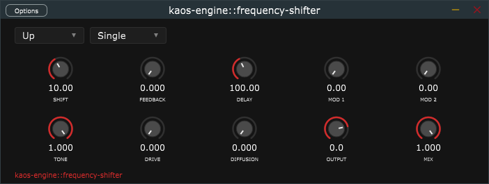

**Directions**

| Direction | Algorithm | Character |
|---|---|---|
| **Up** | `y = I·cos(θ) − Q·sin(θ)` | Every frequency moves +Δ Hz. At small Δ: chorusing and beating. At large Δ: inharmonic, metallic. With feedback: perpetual ascending Risset glissando. |
| **Down** | `y = I·cos(θ) + Q·sin(θ)` | Every frequency moves −Δ Hz. Mirror of up. With feedback: perpetual descending glissando. |
| **Both** | `y = I·cos(θ)` | Simultaneous up + down; Q terms cancel. Sidebands at f_in ± Δ (ring-mod character). With feedback: barberpole Shepard–Risset phasing illusion. |

**Parameters**

| Knob | Symbol | Range | Description |
|---|---|---|---|
| Shift | Δ | 0–5 000 Hz | Frequency offset. Log scale; skew centre 50 Hz |
| Feedback | g | 0–0.99 | Level of the shifted echo fed back before re-shifting. Each pass adds another Δ Hz, creating a Risset glissando |
| Delay | d | 1–2 000 ms | Time between glissando echoes. Only audible when FEEDBACK > 0 |
| Mod 1 | m1 | 0–10 Hz | LFO rate sweeping the shift amount. Creates a barberpole phaser sweep |
| Mod 2 | m2 | 0–500 Hz | LFO depth (peak deviation). `eff_Δ = Δ + m2·sin(m1·t)`. Inactive if MOD 1 = 0 |
| Output | — | −20 to +6 dB | Post-mix output trim |
| Mix | w | 0–1 | Dry/wet blend |

**Implementation:** Yehar's 8-pole IIR polyphase allpass Hilbert network (±0.7° phase error,
20–20 000 Hz). The feedback loop writes the shifted signal to a Hermite-interpolated circular
buffer; reading before writing ensures each echo has been shifted an additional Δ Hz.

---

### kaos-engine::filter

A stereo filter with 12 modes covering the full range of filters used in sound design,
from clean surgical EQ curves to resonant synthesiser filters and metallic comb effects.
A log-scale frequency response display updates in real time as parameters change.

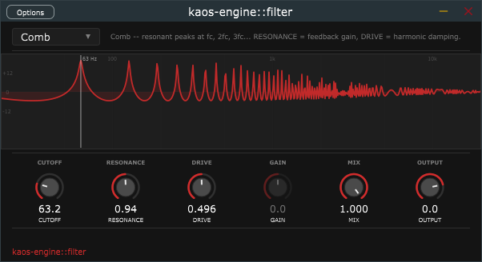

**Modes**

| Mode | Character |
|---|---|
| **LP 12** | 2-pole Simper SVF lowpass, -12 dB/oct. Warm rolloff; resonance peak at cutoff |
| **LP 24** | 4-pole cascaded SVF lowpass, -24 dB/oct. Steep synthesiser-style tone |
| **HP 12** | 2-pole highpass. Bright, open; removes low-end build-up |
| **HP 24** | 4-pole highpass. Tight low cut for clinical clarity |
| **Band Pass** | SVF bandpass. Passes a band around the cutoff, attenuates above and below |
| **Notch** | SVF band-reject. Removes a narrow band; tames resonances and room modes |
| **All Pass** | SVF allpass. Flat magnitude, phase shift near the cutoff. Display shows the 0 dB line with annotation |
| **Peak** | RBJ peaking bell EQ. GAIN sets boost or cut amount |
| **Low Shelf** | RBJ low shelf. Boosts or cuts all frequencies below the cutoff |
| **Hi Shelf** | RBJ high shelf. Boosts or cuts all frequencies above the cutoff |
| **Comb** | Feedback comb. Resonant peaks at the fundamental (cutoff) and every integer harmonic. RESONANCE controls feedback gain; DRIVE controls harmonic damping |
| **Ladder** | 4-pole Moog-style LP using a Stilson-Smith topology with tanh resonance feedback. High RESONANCE approaches self-oscillation |

**Parameters**

| Knob | Range | Description |
|---|---|---|
| Cutoff | 20 Hz – 20 kHz | Filter cutoff / fundamental frequency. Log scale, skew centre 1 kHz. For Comb: sets the spacing between harmonic peaks (fundamental = spacing) |
| Resonance | 0.05 – 20 | Filter Q. 0.707 = Butterworth (flat passband). For Comb: feedback gain (higher = taller, sharper teeth). For Ladder: feedback amount; above ~4 the filter self-oscillates |
| Drive | 0 – 1 | Pre-filter soft saturation (all modes except Comb). Comb only: feedback damping — attenuates upper harmonics progressively; 0 = all teeth equal height, 1 = only fundamental survives |
| Gain | -24 to +24 dB | Boost or cut amount. Active for Peak, Low Shelf, and Hi Shelf only; greyed out for all other modes |
| Mix | 0 – 1 | Dry/wet blend |
| Output | -20 to +6 dB | Post-mix output trim |

**Display:** Log frequency response from 20 Hz to 20 kHz with dB grid at ±12 / 0 dB,
frequency grid lines at 100 Hz / 1 kHz / 10 kHz, and a vertical cutoff frequency marker
labelled in Hz or kHz. The All Pass mode annotates the flat line to explain the phase-only behaviour.

---

### kaos-engine::eq

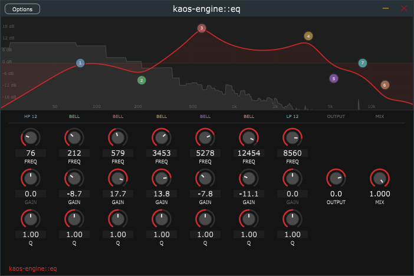

A 5-band parametric equalizer with a real-time spectrum analyzer.

**Bands**

| Band | Filter type | Frequency range | Has GAIN knob |
|---|---|---|---|
| **HP** | High-pass (Butterworth) | 20–2 000 Hz | No |
| **LO SHELF** | Low shelf | 20–1 000 Hz | Yes (±24 dB) |
| **PEAK** | Peaking bell | 200–8 000 Hz | Yes (±24 dB) |
| **HI SHELF** | High shelf | 2 000–20 000 Hz | Yes (±24 dB) |
| **LP** | Low-pass (Butterworth) | 200–20 000 Hz | No |

**Parameters**

| Knob | Range | Description |
|---|---|---|
| FREQ (per band) | Band-specific | Filter cutoff / centre / shelf frequency |
| GAIN (LS, PEAK, HS) | ±24 dB | Boost or cut at the band frequency. 0 dB = flat |
| Q (per band) | 0.1–30 | Filter resonance or shelf slope. 0.707 = Butterworth (maximally flat). Higher = narrower (PEAK) or steeper with slight overshoot (shelves/filters) |
| Output | −20 to +6 dB | Post-EQ output trim to compensate for level changes |
| Mix | 0–1 | Dry/wet blend. 0 = bypass, 1 = full EQ applied |

**Display:** The upper portion shows a semi-transparent spectrum of the live input signal
(2048-point FFT with Hann window, 30 Hz refresh). The red EQ curve is computed analytically
from the current parameter values.

---

### kaos-engine::compressor

A stereo dynamics compressor with three circuit-modelled algorithms, a gain reduction
meter, and parallel compression support via the MIX knob. The feed-forward level detector
uses RMS averaging for a musical response across all modes.

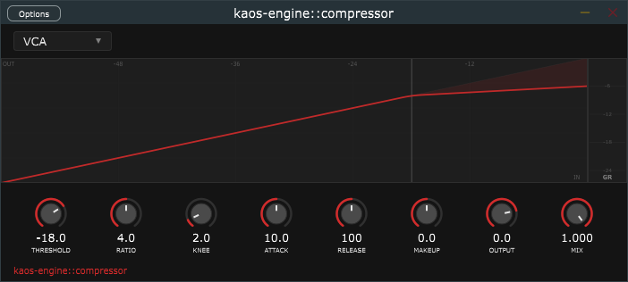

**Algorithms**

| Algorithm | Character |
|---|---|
| **VCA** | Feed-forward, program-independent. Clean and transparent with precise attack/release times. The all-purpose workhorse for mixing and mastering |
| **Optical** | Level-dependent release — faster recovery from short peaks, slower from sustained compression. Musical and "invisible"; models the LA-2A-style optocoupler response |
| **FET** | Feed-back topology with fast attack (down to 0.1 ms). Aggressive, coloured, and punchy. Models the 1176-style FET character — glues drums and buses |

**Parameters**

| Knob | Range | Description |
|---|---|---|
| Threshold | −60 to 0 dBFS | Level above which gain reduction begins |
| Ratio | 1:1 to 20:1 | Compression ratio. 2:1–4:1 = gentle; 8:1+ = heavy limiting |
| Knee | 0–20 dB | Soft-knee width. 0 = hard knee; wider = more gradual onset |
| Attack | 0.1–1 000 ms | Time for gain reduction to reach target. Short = clamps transients; long = lets them through |
| Release | 10–5 000 ms | Recovery time after signal drops below threshold |
| Makeup | −20 to +20 dB | Post-compression gain to restore lost level |
| Output | −20 to +6 dB | Final output trim |
| Mix | 0–1 | Parallel compression blend: 0 = dry, 1 = fully compressed |

---

### kaos-engine::gate

A noise gate / expander / ducker with a state machine (Attack → Hold → Release) and
hysteresis to prevent chattering. Also outputs a **Gate CV** signal on an optional mono
sidechain bus — a +1 V (open) / 0 V (closed) control signal compatible with kaos-engine::lfo's
Sidechain trigger mode, so the LFO starts and stops in response to the gate state.

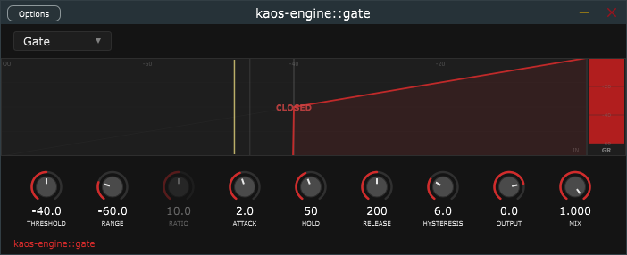

**Algorithms**

| Algorithm | Character |
|---|---|
| **Gate** | Full attenuation below threshold. Binary open/close with RANGE setting the closed-state floor. Cleans up noise floor between phrases |
| **Expander** | Proportional attenuation below threshold using RATIO. Gentler than gating — reduces noise by 10–20 dB rather than silencing it entirely |
| **Ducker** | Attenuates when the *key signal* exceeds threshold. Requires a signal on the Key In sidechain bus. Classic use: music ducks when a vocal is active, or a bass ducks when a kick hits |

**Parameters**

| Knob | Range | Description |
|---|---|---|
| Threshold | −80 to 0 dBFS | Level at which the gate opens |
| Range | −80 to −0.1 dB | Minimum gain when the gate is fully closed. −60 dB = near-silence; −6 dB = subtle ducking |
| Ratio | 1:1 to 100:1 | Expansion ratio for Expander mode. Higher = steeper attenuation below threshold |
| Attack | 0.1–500 ms | Time for the gate to open fully after the signal crosses threshold |
| Hold | 0–2 000 ms | Minimum time the gate stays open after signal drops below threshold — prevents flutter on decaying notes |
| Release | 10–5 000 ms | Time for the gate to close fully after the hold expires |
| Hysteresis | 0–20 dB | Band below threshold where the gate remains open once triggered, preventing chattering on signals hovering near the threshold |
| Output | −20 to +6 dB | Output trim |
| Mix | 0–1 | Dry/wet blend |

**Key In sidechain input:** When the optional stereo Key In bus is connected, its signal is
used for level detection instead of the main input. This is required for Ducker mode and
useful in all modes — for example, keying a gate from a clean drum bus while gating a reverb
return. Mono key signals are automatically folded to both channels.

**Gate CV output:** When the optional Gate CV bus is enabled in the host, a mono CV signal
is written each block: `+1.0` when the gate is open or in hold, `0.0` when closed. Connect
this bus to kaos-engine::lfo's Trigger In sidechain input to make the LFO retrigger whenever
the gate opens.

---

### kaos-engine::noise

A stereo noise generator / processor covering 23 noise sources and 10 blend modes.
Noise types are split into two groups separated by a divider in the combo box:
**always-on** sources generate independently of the input signal (useful as broadband
texturers, drones, and soundscape layers), and **input-reactive** sources derive their
character directly from whatever audio is passing through (the input signal gates, seeds,
or physically excites the noise). Three gate modes control when noise is applied; the
MIX knob is a true dry/wet crossfade.

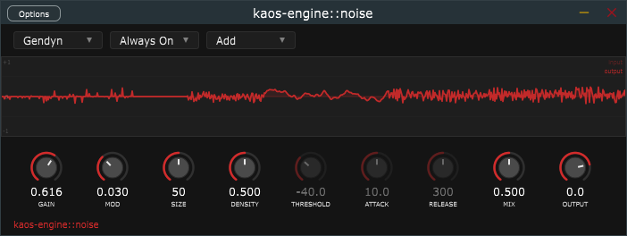

**Always-on noise types**

These types produce output regardless of input signal level. Set Mode to **Always On**
to hear them continuously, or use **Follow** / **Gated** to modulate their level with
the input dynamics.

*Coloured noise*

| Type | Character | Active controls |
|---|---|---|
| **White** | Flat spectrum. Equal energy at all frequencies. Broadband hiss | GAIN |
| **Pink** | -3 dB/oct (1/f). More low-frequency energy. Warmer, more natural sounding than white | GAIN |
| **Blue** | +3 dB/oct. Differentiated white noise. High-frequency emphasis; air, presence, sibilance | GAIN |
| **Brown** | -6 dB/oct (1/f^2). Deep rumble and low roar. Brownian random walk in amplitude | GAIN |

*Structured noise*

| Type | Character | Active controls |
|---|---|---|
| **Granular** | Hann-windowed noise bursts from a 16-voice grain pool. Texture ranges from sparse clicks to a dense overlapping cloud. SIZE = grain length, DENSITY = spawn rate | GAIN, SIZE, DENSITY |
| **Feedback Comb** | White noise through a resonant comb filter. Pitched droning texture at long delay times; metallic ringing at short. SIZE = delay (pitch), DENSITY = feedback gain (resonance) | GAIN, SIZE, DENSITY |
| **Simplex** | Smooth fBm coherent noise. Evolves continuously without random jumps. SIZE = evolution speed, DENSITY = octave count, MOD = persistence (spectral slope) | GAIN, SIZE, DENSITY, MOD |
| **Lorenz** | Lorenz attractor integrated via RK4. Butterfly chaos -- never repeats but has a characteristic spectrum. SIZE = integration step (pitch/speed), DENSITY = rho (low = ordered spirals, high = full chaos) | GAIN, SIZE, DENSITY |
| **Duffing** | Forced double-well oscillator (RK4). Intermittent chaos -- alternates between near-periodic and chaotic bursts as DENSITY changes. SIZE = integration step, DENSITY = forcing amplitude, MOD = forcing frequency | GAIN, SIZE, DENSITY, MOD |
| **Gendyn** | Xenakis stochastic waveform synthesis. N breakpoints connected by linear interpolation; each breakpoint undergoes an independent random walk every cycle. Low MOD = frozen quasi-periodic tone; high MOD = rapidly evolving noise. SIZE = period/pitch, DENSITY = breakpoint count, MOD = mutation rate | GAIN, SIZE, DENSITY, MOD |
| **Harsh Wall** | Four parallel linear comb filters with prime-ratio incommensurate delays (7:11:17:23), summed and passed through a MOD-controlled output saturation. At low DENSITY the spectral peaks are audible as distinct tonal components; at high DENSITY they merge into a dense monolithic wall. SIZE = spectral pitch centre (high frequency to low), DENSITY = comb feedback, MOD = output saturation drive | GAIN, SIZE, DENSITY, MOD |
| **Chua's Circuit** | Chua's double-scroll chaotic attractor (RK4). Piecewise-linear 3D chaos with intermittent pitch-switching between two lobes -- a distinctly different chaos character from Lorenz or Duffing. SIZE = integration step, DENSITY = alpha parameter (9--12; all values are in the chaotic regime) | GAIN, SIZE, DENSITY |
| **Velvet** | Sparse sequence of +1/0/-1 impulses with one impulse per window of M samples. No multiplications in the generator loop. At low DENSITY the impulses are audible as discrete clicks with a reverberant tail; at high DENSITY it approaches a bright shimmer. DENSITY = pulse rate (200--6000 Hz) | GAIN, DENSITY |
| **Missing Fund** | Sinusoids at 2f, 3f, 4f, and 5f with the fundamental f absent. The auditory system infers the missing bass note, implying sub-bass on small speakers or headphones. SIZE = fundamental f0 (15--80 Hz), DENSITY = harmonic rolloff (sparse to rich), MOD = phase noise (0 = pure sinusoids, 1 = slowly drifting texture) | GAIN, SIZE, DENSITY, MOD |
| **Domain Warp** | Two-layer domain-warped fBm. The first fBm pass generates a displacement field; the second pass evaluates at the displaced coordinates. Creates swirling turbulent texture distinct from regular Simplex. SIZE = evolution speed, DENSITY = octaves, MOD = warp depth (0 = regular fBm, 1 = heavily turbulent) | GAIN, SIZE, DENSITY, MOD |

**Input-reactive noise types**

These types derive their output directly from the input signal. They require audio to
be passing through the plugin -- they produce no output in silence regardless of the
Mode setting.

| Type | Character | Active controls |
|---|---|---|
| **Residual** | High-pass residual of the input: `n = x - LP(x)`. The noise is always correlated with what is playing -- it accentuates transients and adds grain to the attack of notes. SIZE = LP cutoff (smaller = higher cutoff = brighter residual) | GAIN, SIZE |
| **Coupled** | Logistic chaos driven by the input level. Loud playing pushes the map into full chaos; quiet playing settles it into period-2 oscillation. DENSITY = base chaos coupling | GAIN, DENSITY |
| **Diffuse** | Three-stage Schroeder allpass cascade applied to the input. The spectrum is unchanged but the signal is smeared in time, creating a diffuse halo around each transient. DENSITY = allpass coefficient | GAIN, DENSITY |
| **Modal** | Inharmonic modal resonator bank (8 modes) excited directly by the input signal. Models the vibrational modes of a metal bar or plate. SIZE = fundamental frequency (100--2000 Hz), DENSITY = inharmonicity coefficient B, MOD = T60 decay time | GAIN, SIZE, DENSITY, MOD |
| **Simplex 2D** | 2D simplex noise field where the input's RMS level navigates the y-axis. Different playing dynamics map to different texture regions of the same noise field. SIZE = evolution speed, DENSITY = octaves, MOD = y-axis depth (how strongly input level moves through the field) | GAIN, SIZE, DENSITY, MOD |
| **Friction Scrape** | Stick-slip bow friction model driving the same inharmonic modal resonator bank as Modal. Below the slip threshold the model is in the stick regime: smooth, proportional force. Above threshold it enters the slip regime: saturated Coulomb friction plus broadband scraping noise. The cycling between stick and slip produces creaking, scraping, and metallic industrial textures that respond to playing dynamics. SIZE = modal fundamental (100--2000 Hz), DENSITY = inharmonicity and slip threshold (low = slips easily = rougher; high = stiff bow = smoother ring), MOD = T60 decay | GAIN, SIZE, DENSITY, MOD |
| **Gendyn Driven** | Gendyn stochastic waveform synthesis where the input amplitude modulates the mutation rate. Quiet playing freezes the waveform into a near-periodic tone; loud transients accelerate the stochastic mutation toward noise. SIZE = period/pitch, DENSITY = breakpoint count (2--16), MOD = base mutation rate | GAIN, SIZE, DENSITY, MOD |
| **Karplus-Strong** | Inharmonic waveguide physical model. The input continuously excites a delay line with a lowpass damping filter and a stiffness allpass in the feedback loop. Produces bell and plate resonances that respond to note attacks and sustain. MOD = 0 gives harmonic string character; high MOD introduces progressive dispersion that stretches upper harmonics upward, giving a metallic bell or inharmonic plate quality. SIZE = pitch (5 ms = 2000 Hz high metallic bell; 500 ms = 50 Hz deep plate resonance), DENSITY = lowpass damping (0 = bright and sustained, 1 = dark and percussive), MOD = stiffness dispersion | GAIN, SIZE, DENSITY, MOD |

**Gate modes**

| Mode | Behaviour |
|---|---|
| **Follow** | Noise amplitude tracks the input envelope proportionally. Louder input = louder noise. Below THRESHOLD the noise fades to zero via the RELEASE tail |
| **Gated** | Binary gate -- noise snaps fully on when the input crosses THRESHOLD and fades fully off when it drops below. ATTACK and RELEASE smooth the transitions |
| **Always On** | Noise runs continuously at fixed amplitude. THRESHOLD, ATTACK, and RELEASE are inactive. Required for always-on types with no input signal |

**Blend modes**

Controls how the processed noise signal combines with the dry input.

| Blend | Signal flow | Notes |
|---|---|---|
| **Add** | `out = (1 - mix)*x + mix*n` | Standard crossfade. MIX = 0 passes input only; MIX = 1 passes noise only |
| **AM** | `out = x * (1 + mix*n)` | Noise amplitude-modulates the signal. Input is always present; its amplitude fluctuates at the noise rate |
| **Saturate** | `out = lerp(x, tanh(x + mod*n), mix)` | Noise injected before a soft clipper. MOD = injection depth. Low MOD = warmth; high MOD = noise-modulated distortion |
| **Spectral** | `|X_k|' = |X_k| * (1 + mod*n_k)` | OLA (1024-pt, ~11 ms). Each bin scaled independently by a different noise sample. MOD = deviation depth |
| **Phase Random** | OLA: preserve magnitudes, rotate bin phases by `mod * pi` | Smears transients and temporal coherence without affecting the spectral envelope. MOD = rotation depth |
| **Ring Mod** | `out = (1 - mix)*x + mix*(x*n)` | Suppressed-carrier AM. At MIX = 1 only sidebands remain; the original signal is absent |
| **Infrasonic AM** | `out = x * (1 + mix * sin(2*pi*f*t))` | Sub-20 Hz LFO amplitude-modulates the signal. MOD = LFO frequency (0.1--19 Hz). Creates psychoacoustic unease and low-frequency physical pulsing |
| **Roughness** | `out = (1 - mix)*x + mix*(x * sin(2*pi*fc*t))` | Ring modulation at a sub-200 Hz carrier. MOD = carrier frequency (20--200 Hz). Adds sidebands within the Plomp-Levelt critical bandwidth of each harmonic, directly targeting perceived roughness and dissonance |
| **Sample Rate** | ZOH decimation: hold each input sample for N samples | MOD = decimation factor (1--32x). At 32x the effective sample rate drops to ~1.4 kHz, creating heavy aliasing artifacts. MIX blends dry and decimated signals |
| **Spectral Envelope** | OLA: replace bin magnitudes with a target noise-colored profile, preserve input phases | Substitutes the input's spectral shape with a noise color while keeping its temporal/transient structure in the phases. MOD = spectral slope (0 = flat/white, 1 = brown/steep). MIX = blend depth. ~11 ms latency |

**Parameters**

| Knob | Range | Description |
|---|---|---|
| Gain | 0--1 | Noise amplitude before the blend stage |
| Mod | 0--1 | Type-specific modifier (chaos parameter, phase noise, mutation rate, stiffness, etc.) or injection depth for Saturate / Spectral blend modes. Greyed out when inactive |
| Size | 5--500 ms | Type-specific size/speed/pitch parameter. Meaning varies by type; see tables above. Greyed out when inactive |
| Density | 0--1 | Type-specific density/chaos/feedback parameter. Greyed out when inactive |
| Threshold | -60 to 0 dBFS | Follow / Gated: input level at which noise activates. Inactive in Always On mode |
| Attack | 0.1--500 ms | Follow / Gated: time for noise to fade in. Inactive in Always On mode |
| Release | 1--5000 ms | Follow / Gated: time for noise to decay. Inactive in Always On mode |
| Mix | 0--1 | Dry/wet crossfade. 0 = input only; 1 = processed signal only |
| Output | -20 to +6 dB | Final output trim |

**Display:** Dual-line scrolling strip chart at 30 Hz. The faint red line is the raw
input (dry). The bright red line with fill is the processed output (wet). Input-reactive
types with no input signal show a flat line -- this is expected behaviour.

---

### kaos-engine::looper

A stereo loop recorder with five playback modes, DAW-synced or freeform recording,
MIDI CC transport control, and a waveform display with a real-time playback cursor.
The FEEDBACK parameter controls amplitude decay on each loop pass across all modes,
letting loops fade out gradually or sustain indefinitely.

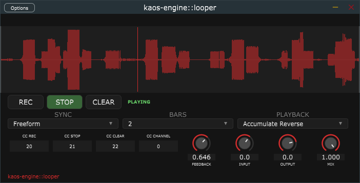

**Transport**

| Button | Action |
|---|---|
| **REC** | Start recording. In Time Sync mode the recording begins at the next bar boundary. In Freeform mode recording starts immediately. Pressing REC while Stopped restarts a new recording over the existing buffer |
| **STOP** | Stop recording and begin playback; or pause playback if already playing. In Time Sync mode the recording stops at the next bar boundary |
| **CLEAR** | Discard the loop buffer immediately in any state and return to Idle |

**Playback modes**

| Mode | Behaviour |
|---|---|
| **Forward** | Loop plays from start to end, repeating. At each loop boundary the buffer is scaled by FEEDBACK. FEEDBACK = 1.0 sustains the loop indefinitely; lower values cause it to fade each cycle |
| **Backward** | Loop plays from end to start, reversing. Same FEEDBACK boundary decay as Forward |
| **Bounce** | Playhead alternates direction -- forward to the end, then backward to the start, then forward again. FEEDBACK is applied once per complete forward+backward cycle |
| **Accumulate** | Playhead moves forward. At each sample the live input is added directly to the buffer (`buf += input`). At the loop boundary the entire buffer is scaled by FEEDBACK. Layers of input accumulate, with each pass fading the previous content by FEEDBACK |
| **Accumulate Reverse** | Same as Accumulate but the buffer is also reversed at each loop boundary. The effect is a reversing echo cascade: pass 1 records normally; at the boundary the buffer is reduced by FEEDBACK and flipped, so pass 2 hears the reversed recording while overdubbing new material; at the next boundary the combined content is again reduced and flipped, returning pass 1's material to its original orientation but quieter, while pass 2's material is now reversed. Each subsequent pass adds another layer while all existing layers decay and alternate direction |

**Sync modes**

| Mode | Behaviour |
|---|---|
| **Freeform** | Recording starts and stops instantly on REC / STOP |
| **Time Sync** | Recording aligns to bar boundaries from the DAW clock. The BARS parameter sets how many bars to record before auto-stopping. Use when the loop length must be an exact musical phrase |

**MIDI CC control**

The looper responds to three configurable MIDI CC numbers on a configurable channel.
All three trigger on the leading edge (value crosses 64 from below), so a momentary
footswitch or pad sends one command per press regardless of hold time.

| Field | Default CC | Description |
|---|---|---|
| CC REC | 20 | Trigger the REC command |
| CC STOP | 21 | Trigger the STOP command |
| CC CLEAR | 22 | Trigger the CLEAR command |
| CC CHANNEL | 0 | MIDI channel to listen on. 0 = respond to any channel |

**Parameters**

| Knob | Range | Description |
|---|---|---|
| Feedback | 0--1 | Amplitude scale applied to the entire buffer at each loop boundary. 1.0 = no decay; 0.5 = each pass is half as loud as the previous. Active in all playback modes |
| Input | -20 to +12 dB | Pre-gain on the live input before recording or overdubbing. Boost quiet sources or attenuate loud ones |
| Output | -20 to +6 dB | Post-mix output trim |
| Mix | 0--1 | Blend between live input passthrough and loop playback. 0 = input only; 1 = loop only |

**Display:** The waveform area shows the peak amplitude of the recorded loop as a
centred symmetric waveform (white or brighter = louder). During recording a red progress
bar and cursor advance left to right. During playback a vertical red cursor marks the
current read position. The state label (IDLE / WAIT REC / RECORDING / WAIT STOP /
PLAYING / STOPPED) reflects the current state with colour coding: red = recording,
green = playing, blue = stopped.

**Maximum recording time:** 30 seconds at any sample rate. The buffer is pre-allocated
at `prepareToPlay` so there is no allocation during recording.

---

## Analyzers

Analyzers pass audio through unmodified and display information about the signal.

---

### kaos-engine::spectrogram

A scrolling spectrogram that displays the frequency content of the input signal over
time. Audio passes through unchanged. The display updates at 30 Hz with a new row of
frequency data scrolled in from the bottom; older time is above, newest is at the
bottom. The frequency axis is logarithmic (20 Hz -- 20 kHz) matching human pitch
perception. Amplitude is encoded as colour using a five-point gradient tuned to the
project palette.

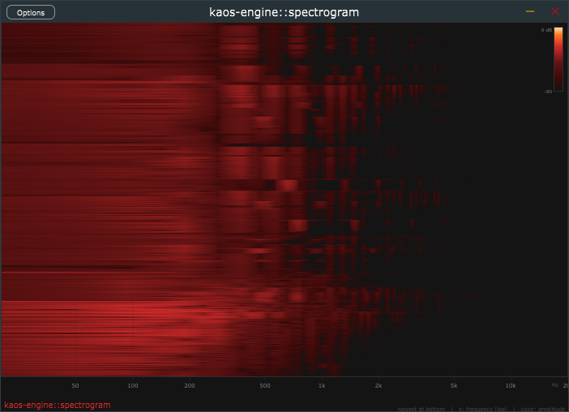

**Display**

| Element | Description |
|---|---|
| **Spectrogram image** | 700 x 438 px scrolling image. Each row is one FFT frame (~46 ms at 44.1 kHz). Time flows upward; the most recent frame is always at the bottom |
| **Frequency axis** | Log scale from 20 Hz to 20 kHz with tick marks and labels at 50, 100, 200, 500, 1k, 2k, 5k, 10k, 20k Hz. Faint vertical gridlines extend into the image |
| **Color scale** | Legend in the top-right corner of the image. Maps 0 dB (near-white peak) to -90 dB (background black) via cadmium red and dark orange |

**Color map**

| Level | Colour | Meaning |
|---|---|---|
| 0 dB | Near-white (255, 230, 180) | Full-scale signal |
| -11 dB | Hot orange (255, 120, 30) | Very loud |
| -30 dB | Cadmium red (210, 43, 43) | Moderately loud (project accent colour) |
| -55 dB | Dark red (100, 20, 20) | Quiet |
| -80 dB | Very dark red (60, 10, 10) | Near noise floor |
| -90 dB | Background (20, 20, 20) | Silence |

**FFT settings:** 2048-point FFT with Hann window. Frequency resolution: ~21.5 Hz per
bin at 44.1 kHz. Each display column maps to a fractional bin index computed from the
log-frequency mapping; linear interpolation between adjacent bins prevents visible
block boundaries at low frequencies where multiple columns would otherwise snap to the
same integer bin.

---

## Controllers

Controllers generate modulation signals rather than transforming audio. Their output is
routed to plugin parameters or other controllers — not heard directly.

---

### kaos-engine::lfo

A low-frequency oscillator with 11 waveforms, a SHAPE modifier, and three output paths:
**MIDI CC** (parameter automation in any DAW), **Audio CV** (a mono sidechain bus carrying
the LFO signal as a −1..+1 control voltage), and both simultaneously. Passes stereo audio
through unmodified. Four trigger modes control when the oscillator runs and resets.

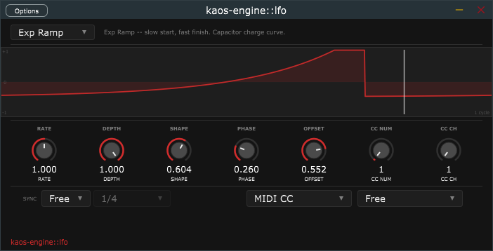

**Waveforms**

| Waveform | Character | SHAPE effect |
|---|---|---|
| **Sine** | Smooth, no harmonics. Default for tremolo and vibrato | No effect |
| **Triangle** | Linear ramp up/down, odd harmonics, softer than square | No effect |
| **Square** | Hard toggle between ±1 — rhythmic gating and hard tremolo | No effect (use Pulse for variable duty) |
| **Sawtooth** | Rising ramp — classic analogue-style filter sweep | No effect |
| **Rev. Saw** | Falling ramp — closing filter sweep | No effect |
| **Half Sine** | abs(sin) — two bumps per cycle, always ≥ 0. Bouncing-ball feel | No effect |
| **Exp Ramp** | Rises −1→+1 slowly then accelerates. Capacitor charge curve | Curve steepness (0 = near-linear, 1 = very steep) |
| **Log Ramp** | Rises −1→+1 quickly then levels off. Capacitor discharge curve | Curve steepness (0 = near-linear, 1 = very steep) |
| **Pulse** | Square with variable duty cycle. Narrow spikes to wide pulses | Duty cycle (0 = narrow, 0.5 = square, 1 = wide) |
| **Staircase Up** | Sawtooth quantised to discrete steps, rising −1→+1 | Step count (0 = 2 steps, 1 = 16 steps) |
| **Staircase Down** | Mirror of Staircase Up, falling +1→−1 | Step count (0 = 2 steps, 1 = 16 steps) |

**Parameters**

| Knob | Range | Description |
|---|---|---|
| Rate | 0.01–100 Hz | LFO frequency when Tempo Sync is off |
| Depth | 0–1 | Amplitude scale applied to the raw waveform. `out = waveform * depth + offset` |
| Shape | 0–1 | Waveform-specific modifier; see table above. No effect on most waveforms |
| Phase | 0–1 | Starting phase offset. 0.5 = begin 180° into the cycle |
| Offset | −1 to +1 | DC shift added after depth scaling. Offset +0.5 with Depth 0.5 → unipolar 0..+1 |
| CC Num | 0–127 | MIDI CC number (active in MIDI CC mode) |
| CC Ch | 1–16 | MIDI channel for CC messages |

**Trigger modes**

| Mode | Behaviour |
|---|---|
| **Free** | LFO runs continuously from startup. No external trigger needed |
| **Note Retrigger** | MIDI note-on resets phase to zero and starts the LFO; note-off holds the current value |
| **Transport** | DAW play resets and starts; DAW stop holds the current value |
| **Sidechain** | Rising edge on Trigger In bus (> 0.6) resets and starts; falling edge (< 0.4) holds. Connect kaos-engine::gate's Gate CV output here |

**Controls**

| Control | Options | Description |
|---|---|---|
| Sync | Free / Sync | When Sync, rate is locked to host BPM and the Phase is aligned to the DAW transport position |
| Division | Whole / Half / Dotted 1/4 / 1/4 / Dotted 1/8 / 1/8 / 1/8 Triplet / 1/16 | Beat subdivision for tempo-synced mode |
| Output Mode | MIDI CC / Audio CV / MIDI CC + CV | Which output path(s) are active |

**Plugin formats:** builds as **VST3** and **CLAP**. The CLAP build (`kaos-engine-lfo.clap`)
enables native parameter modulation routing in Bitwig Studio, Reaper, and FL Studio 2024+.

---

### kaos-engine::stochastic

A stochastic modulation controller with six signal-generation modes ranging from classic
sample-and-hold to deterministic chaos.

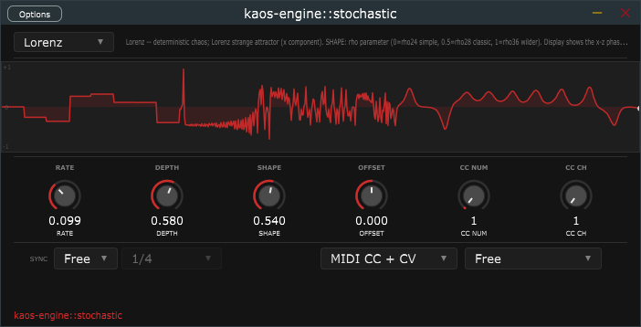 

Like the LFO, it passes stereo audio through
unmodified and outputs a control signal via MIDI CC, Audio CV, or both. A scrolling
strip chart shows the live output signal in real time.

**Modes**

| Mode | Character | SHAPE |
|---|---|---|
| **S+H** | Jumps to a new random value at each clock tick. The classic "staircase" CV | Output range: 0 = narrow (near zero), 1 = full [-1..+1] |
| **S+Glide** | Like S+H but slides smoothly between values | Glide fraction: 0 = instant jump, 1 = always gliding |
| **Smooth** | Cubic interpolation between random targets -- continuous, no discontinuities | Curve: 0 = linear ramp, 1 = smoothstep |
| **Brownian** | Ornstein-Uhlenbeck random walk. Output drifts organically then returns | Mean reversion: 0 = free drift, 1 = strong pull to zero |
| **Lorenz** | Lorenz strange attractor (x component). Deterministic chaos -- never repeats | rho parameter: 0 = rho 24 (simpler orbits), 0.5 = rho 28 (classic), 1 = rho 36 (wilder) |
| **Logistic** | Logistic map x -> r*x*(1-x) iterated at the clock rate | Chaos: 0 = period-2 at r=3.5, 1 = fully chaotic at r=4.0 |

**Parameters**

| Knob | Range | Description |
|---|---|---|
| Rate | 0.01-100 Hz | Clock speed for all modes. In Sync mode this is derived from the host BPM |
| Depth | 0-1 | Output amplitude scale |
| Shape | 0-1 | Mode-specific modifier; see table above |
| Offset | -1 to +1 | DC shift added after depth scaling |
| CC Num | 0-127 | MIDI CC number (active in MIDI CC output modes) |
| CC Ch | 1-16 | MIDI channel for CC messages |

**Controls**

| Control | Options | Description |
|---|---|---|
| Sync | Free / Sync | When Sync, Rate is derived from the host BPM and the Division selector |
| Division | Whole to 1/16 | Beat subdivision for tempo-synced mode |
| Output Mode | MIDI CC / Audio CV / MIDI CC + CV | Which output paths are active |
| Trigger Mode | Free / Note Retrigger / Transport | When Free, runs continuously. Note Retrigger resets state on MIDI note-on. Transport resets on DAW play |

---

### kaos-engine::envelope-follower

An amplitude envelope detector that tracks the loudness of an incoming signal and
outputs that as a CV or MIDI CC. Insert it on any track and it will follow the
amplitude of that signal, or connect an optional stereo **Sidechain** bus to follow
a separate source. Five output shapes let you derive different control curves from
the same envelope -- from direct tracking to onset detection to release phase monitoring.

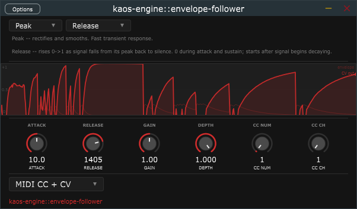

**Output shapes**

| Shape | Character | Use case |
|---|---|---|
| **Follow** | CV = envelope level directly. Louder input = higher CV | Tremolo, auto-wah, vocoder AM, general envelope-to-parameter mapping |
| **Duck** | CV = 1 - envelope. Loud input = low CV | Sidechain ducking: music drops when the kick hits, rises when it stops |
| **Rise** | CV = envelope only while signal is rising, 0 during decay | Onset/transient detector; triggers on each new note attack |
| **Fall** | CV = envelope only while signal is falling, 0 during attack | Decay phase detector; responds to note releases |
| **Release** | Rises 0->1 as signal falls from peak back to silence | Starts at 0 when signal peaks; grows as the note decays. Useful for crossfades, reverb swells, and anything that should intensify as a sound dies away |

**Parameters**

| Knob | Range | Description |
|---|---|---|
| Attack | 0.1-500 ms | How quickly the envelope responds to a rising signal. Short = catches every transient; long = smooths over them |
| Release | 1-5000 ms | How quickly the envelope decays after the signal drops |
| Gain | 0.1x-20x | Pre-detection input scaling. Increase to make quiet signals fill the full [0,1] output range |
| Depth | 0-1 | Output scale applied after shaping |
| CC Num | 0-127 | MIDI CC number (active in MIDI CC output modes) |
| CC Ch | 1-16 | MIDI channel for CC messages |

**Detector** (combo, top-left)

| Mode | Algorithm | Character |
|---|---|---|
| **Peak** | Rectifies the signal then applies ballistics | Fast transient response; responds to instantaneous peaks |
| **RMS** | Squares, low-pass filters, then takes sqrt | Tracks perceived loudness; less reactive to brief spikes |

**Display:** Dual-line scrolling strip chart. The faint red line is the raw detected
envelope (input level). The bright red line with fill is the shaped CV output. Switching
shapes makes the two lines visually diverge -- for example, in Release mode the input
falls while the CV rises, and in Rise mode the CV is zero during quiet passages.

**Sidechain bus:** When the optional stereo Sidechain input is connected, its signal
is used for detection instead of the main input. The main audio still passes through
unmodified. Use this to duck one track based on the loudness of another, or to connect
kaos-engine::gate's Gate CV output to trigger envelope-following in sync with gate events.

---

## Building

Requires [Meson](https://mesonbuild.com/) >= 1.1 and a C++17 compiler.

```sh
meson setup build --buildtype=release
meson compile -C build
```

Targets: **Windows** (x86_64, MinGW-w64) and **Linux** (x86_64).
Output formats: **VST3** (all plugins) and **CLAP** (kaos-engine::lfo).

**CLAP note:** The `kaos-engine-lfo.clap` file is a shared library with the `.clap`
extension. Load it in any CLAP-aware host (Bitwig, Reaper, FL Studio 2024+) the same
way you would a VST3 — point the host's plugin scanner at the build output directory.
No runtime toggle is required: the format is determined by which file the host loads.

---

## Project layout

```
kaos-engine/
├── meson.build              # top-level build definition
├── src/
│   ├── effects/
│   │   ├── distortion/      # waveshaper DSP
│   │   ├── delay/           # delay line DSP
│   │   ├── reverb/          # reverb algorithms
│   │   ├── pitch_shifter/   # granular pitch shifting DSP (3 voices, 3 algorithms)
│   │   ├── modulator/       # AM / tremolo / ring mod DSP
│   │   ├── frequency_shifter/ # SSB Hilbert frequency shifter DSP
│   │   ├── filter/          # multi-mode filter DSP (SVF, biquad, comb, ladder)
│   │   ├── eq/              # 5-band parametric EQ DSP (RBJ biquads)
│   │   ├── compressor/      # dynamics compressor DSP (VCA / Optical / FET)
│   │   ├── gate/            # noise gate / expander / ducker DSP
│   │   ├── noise/           # noise generator DSP (23 types, 10 blend modes)
│   │   ├── looper/          # loop recorder DSP (5 playback modes, FEEDBACK decay)
│   │   └── spectrogram/     # passthrough analyzer (FFT + scrolling display)
│   ├── framework/
│   │   ├── lfo/             # LFO controller DSP (no JUCE dependency)
│   │   ├── stochastic/      # stochastic controller DSP (6 modes inc. Lorenz attractor)
│   │   └── envelope_follower/ # envelope follower DSP (Peak/RMS, 5 output shapes)
│   ├── plugin/              # JUCE AudioProcessor wrappers + editors + shared LookAndFeel
│   └── standalone/          # standalone app build targets
├── doc/
│   └── images/              # plugin screenshots referenced in this README
├── third_party/             # JUCE 7 (git submodule)
└── build/                   # generated by meson (not committed)
```

All C++ symbols live in the `kaos_engine` namespace.

---

## License

[GNU Affero General Public License v3.0](https://www.gnu.org/licenses/agpl-3.0.html) (AGPL-3.0)

---

## Glossary

Acronyms and abbreviations used across the plugins, UI labels, and documentation.

| Acronym | Full name | Description |
|---|---|---|
| **AM** | Amplitude Modulation | Multiplying a signal by a carrier to produce sidebands at f_in ± f_carrier. When the carrier includes a DC bias the original signal is preserved alongside the sidebands. |
| **AP** | Allpass (filter) | A filter with a flat magnitude response that shifts phase. Used for diffusion in reverbs and as a fractional-delay interpolator. An AP section: `y[n] = −a·x[n] + x[n−1] + a·y[n−1]`. |
| **API** | Application Programming Interface | A defined boundary through which software components communicate. Used in kaos-engine to refer to the JUCE AudioPlayHead API (reads DAW transport position and tempo) and the CLAP plugin API (defines the contract between plugins and hosts). |
| **BBD** | Bucket-Brigade Device | An analog delay line built from a chain of capacitors that pass charge from stage to stage at a clock rate. Emulated here via a shift-register buffer with a low-pass output filter. |
| **CLAP** | CLever Audio Plugin | Open plugin API developed by u-he and Bitwig (2022). Defines sample-accurate parameter modulation, per-note expression (MPE-style), and a standardised parameter modulation routing API between plugins. kaos-engine::lfo builds as `.clap` in addition to VST3. Supported by Bitwig Studio, Reaper, and FL Studio 2024+. |
| **BP** | Band-Pass (filter) | A filter that passes a band of frequencies centred on the cutoff and attenuates both below and above it. |
| **BPM** | Beats Per Minute | Tempo unit. Used to sync delay times to a musical grid: `quarter_note_ms = 60 000 / BPM`. |
| **CPU** | Central Processing Unit | General compute load. Used informally to mean DSP processing cost per sample block. |
| **CV** | Control Voltage | In analog synthesis, a voltage signal (typically 0–5 V or ±5 V) used to modulate parameters rather than carry audio. In kaos-engine, Audio CV refers to a modulation signal on a dedicated mono sidechain bus, where sample values in the range −1..+1 carry the control signal. The gate outputs a unipolar 0/+1 gate signal; the LFO outputs a bipolar −1..+1 waveform. DAWs that support sidechain routing (Bitwig, Reaper) can connect these buses to plugin parameters or other controllers. |
| **ct** | Cent | One hundredth of a semitone. Used for fine pitch offsets: 100 ct = 1 st. |
| **DAW** | Digital Audio Workstation | The host software used to record, arrange, mix, and master audio (e.g. Bitwig Studio, Reaper, Ableton Live, FL Studio). DAWs host VST3 and CLAP plugins, provide the audio clock and block size, and expose transport state (play/stop, BPM, bar position) that plugins read via the JUCE AudioPlayHead API. |
| **dB** | Decibel | Logarithmic unit of level. +6 dB ≈ double amplitude; −6 dB ≈ half amplitude. |
| **DC** | Direct Current (offset) | A non-zero mean value in an audio signal. Asymmetric waveshapers and rectifiers introduce DC; removed with a DC-blocking IIR filter: `y[n] = x[n] − x[n−1] + R·y[n−1]`, R ≈ 0.995. |
| **DSP** | Digital Signal Processing | The mathematics of manipulating audio (or other signals) in the discrete-time domain. |
| **EQ** | Equalizer | A filter (or bank of filters) that adjusts the relative level of different frequency bands in a signal. kaos-engine::eq is a 5-band parametric EQ; simpler single-band shelving and peak filters also appear in the distortion and reverb filter sections. |
| **FDN** | Feedback Delay Network | A reverb architecture of N delay lines cross-coupled through a unitary mixing matrix (typically Hadamard). Energy-preserving; produces smooth, dense tails. |
| **FET** | Field-Effect Transistor | A semiconductor device whose fast, nonlinear response characterises FET-based compressors such as the UREI 1176. In kaos-engine::compressor's FET mode the feed-back topology and level-dependent attack speed model this character: short attacks, an aggressive punch, and audible colouration at high ratios. |
| **FFT** | Fast Fourier Transform | An O(N log N) algorithm for computing the Discrete Fourier Transform, converting a block of time-domain samples into a frequency-domain magnitude/phase spectrum. Used in kaos-engine for the EQ and spectrogram displays (magnitude spectrum), the noise Spectral blend mode (per-bin OLA processing), and pitch-shift frame analysis. JUCE's `dsp::FFT` provides the implementation. |
| **FIR** | Finite Impulse Response | A filter whose output depends only on a finite window of past inputs; always stable. Used in windowed-sinc interpolation and velvet-noise reverb. |
| **FM** | Frequency Modulation | Varying the instantaneous frequency (or phase) of a carrier by a modulator signal. At audio rates this generates sidebands described by Bessel functions. |
| **Hz / kHz** | Hertz / Kilohertz | Cycles per second / thousands of cycles per second. Used for frequencies and sample rates. |
| **HP** | High-Pass (filter) | A filter that passes frequencies above the cutoff and attenuates those below it. |
| **IIR** | Infinite Impulse Response | A filter with feedback; its output depends on past outputs as well as past inputs. Can be unstable if poles are outside the unit circle. Used for AP sections, tone filters, and DC blockers. |
| **IR** | Impulse Response | The output of a system when fed a single unit impulse. Fully characterises a linear time-invariant system; used in convolution reverb. |
| **JAES** | Journal of the Audio Engineering Society | Peer-reviewed publication. The Dattorro plate reverb algorithm originates from a 1997 JAES paper. |
| **JUCE** | Jules' Utility Class Extensions | Open-source C++ framework for building audio plugins and applications. Provides the VST3 wrapper, GUI components, and audio I/O used by kaos-engine. |
| **LFO** | Low-Frequency Oscillator | An oscillator running at sub-audio rates (typically 0.05–20 Hz) used to modulate parameters over time (tremolo, vibrato, wow/flutter). In kaos-engine the LFO is a standalone controller plugin that routes its output via MIDI CC or Audio CV to other plugins. |
| **LP** | Low-Pass (filter) | A filter that passes frequencies below the cutoff and attenuates those above it. Used for tone shaping and as a damping filter in delay/reverb feedback paths. |
| **MIDI** | Musical Instrument Digital Interface | A serial communication protocol (1983) for transmitting musical events between devices and software. MIDI CC (Continuous Controller) messages carry 7-bit values (0–127) on a numbered channel (1–16) and can be mapped to plugin parameters in most DAWs. kaos-engine::lfo outputs MIDI CC messages from its `processBlock` when set to MIDI CC or MIDI CC + CV mode. |
| **MPE** | MIDI Polyphonic Expression | A MIDI extension that assigns per-note pitch bend, pressure (aftertouch), and slide to individual MIDI channels, enabling expressive per-note control on compatible controllers and instruments. Referenced in the context of the CLAP plugin format's native per-note expression support. |
| **ms** | Milliseconds | One thousandth of a second. Standard unit for delay times and reverb pre-delay. |
| **OLA** | Overlap-Add | A time-domain technique for time-stretching and pitch-shifting. Successive windowed frames of the input are written at a different hop size to stretch or compress time; resampling then corrects pitch. |
| **Q** | Quality factor | Dimensionless measure of filter resonance. Q = f_centre / bandwidth. Q = 0.707 gives a maximally flat (Butterworth) response; higher Q produces a sharper resonant peak. |
| **RBJ** | Robert Bristow-Johnson | Author of the widely-cited *Audio EQ Cookbook*, the standard reference for second-order biquad filter design. The kaos-engine::eq and kaos-engine::filter plugins use RBJ formulas for peaking bell EQ, shelving filters, and Butterworth lowpass/highpass responses. |
| **RMS** | Root Mean Square | `sqrt(mean(x[n]^2))` computed over a short window. Correlates better with perceived loudness than instantaneous peak detection because it averages energy over time. Used in kaos-engine::compressor for the level detector and in kaos-engine::envelope-follower as an alternative to peak detection. |
| **RT60** | Reverberation Time (60 dB) | The time for a room's sound energy to decay by 60 dB after a source stops. A standard measure of perceived reverb length. |
| **S+H** | Sample and Hold | A circuit (or its DSP equivalent) that reads an input value at a clock tick and holds it unchanged until the next tick. In kaos-engine::stochastic's S+H mode a new random value is drawn at each clock tick and held until the next, producing the classic staircase CV pattern associated with analogue random voltage sources and early sequencers. |
| **SSB** | Single-Sideband | A modulation method that produces only one sideband (upper or lower) rather than both. In kaos-engine::frequency-shifter, SSB is achieved via the phasing method: the Hilbert transform path cancels the unwanted sideband. |
| **st** | Semitone | One twelfth of an octave. A frequency ratio of 2^(1/12) ≈ 1.0595. |
| **SVF** | State Variable Filter | A two-integrator-loop filter topology (Simper variant used here) that simultaneously outputs LP, HP, and BP responses from the same state, making it easy to switch type without discontinuity. |
| **UI** | User Interface | The visual and interactive portion of a plugin — the editor window containing knobs, sliders, combo boxes, displays, and buttons. In JUCE, the UI runs on the message thread and is kept separate from the audio processing thread. |
| **VCA** | Voltage-Controlled Amplifier | An amplifier whose gain is set by a control voltage rather than a fixed resistor. In hardware compressors the VCA is the gain element that applies the computed gain reduction to the audio signal. kaos-engine::compressor's VCA mode models a clean, feed-forward topology with program-independent attack and release times. |
| **VST3** | Virtual Studio Technology 3 | Plugin format developed by Steinberg. The standard format for audio effects and instruments on Windows and Linux. kaos-engine builds each effect as a `.vst3` bundle. |
| **ZOH** | Zero-Order Hold | A sample-and-hold operation that holds the last sampled value for N samples before updating. Used in sample-rate reduction to produce intentional aliasing artifacts. |
